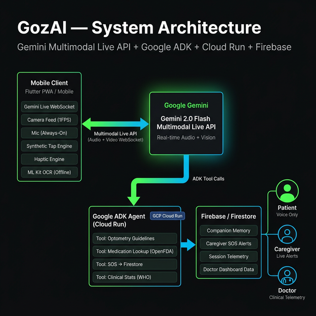

# 👁️ GozAI — Your Voice-First Emotional & Accessibility Copilot


[](https://github.com/Kryptopacy/GozAI)

**GozAI is an empathetic, voice-first companion that acts as the eyes and hands for people with low vision, bridging the gap between them and inaccessible digital/physical environments.**

👉 **[Try the Live Web Demo Here](https://gozai.vercel.app)** 👈

> **"GozAI isn't just an app that looks at things — it's an empathetic, continuously aware copilot that restores independence and psychological safety."**

Low vision affects over **2.2 billion people globally**. Standard screen readers fail when faced with unlabelled digital UIs, and traditional AI tools require you to manually snap photos like a robot, causing cognitive fatigue. The psychological toll—loneliness, frustration, and anxiety—is massive, yet entirely ignored by modern tech.

**GozAI fixes this.** We engineered a real-time, voice-first companion using the **Gemini Multimodal Live API**. Goz acts as your eyes, your hands on digital screens, and a supportive talk-partner when you need one.

---

## ✨ Comprehensive Feature Matrix

| Feature | Description | Status |
|---|---|---|
| **Empathetic Voice Persona** | Clinically tuned to reduce anxiety; acts as a supportive talk-partner. | ✅ Live |
| **Zero-UI Launch** | Opens instantly to an active mic via voice assistant (e.g., "Hey Siri, open Goz"). | ✅ Live |
| **Seamless Barge-In** | Natural interruptions instantly halt AI speech and audio buffers. | ✅ Live |
| **UI Navigator (Screen Capture)** | Captures OS-level/browser screens to read unlabelled UI elements. | ✅ Live |
| **Synthetic UI Taps** | GozAI calculates coordinates and injects synthetic taps for the user. | ✅ Live |
| **Caregiver SOS System** | Autonomously detects distress and triggers urgent Firestore alerts. | ✅ Live |
| **Universal Product Scanner** | Native barcode scanning + OpenFDA/OpenFoodFacts data grounding. | ✅ Live |
| **Companion Memory** | Remembers user facts (medications, names, preferences) across sessions natively via Firestore. | ✅ Live |
| **Hardware Re-activation** | Proactively identifies disabled cameras/mics and offers to re-initialize them autonomously. | ✅ Live |
| **Auto Language Detection** | Mirrors the user's spoken language instantly; fully voice-controlled. | ✅ Live |
| **Edge Case Resilience** | Detects offline states and critically low battery, warning the user proactively. | ✅ Live |
| **Semantic Vibro-Acoustics** | Uses synchronized haptics for navigation / hazard warnings to reduce cognitive load. | ✅ Live |

---

## 🛠️ Real-world Solutions to Daily Problems (ADLs)

GozAI is built strictly around the five core Activities of Daily Living (ADLs) that dictate a low-vision patient's independence. It is designed to be your constant, hands-free companion.

### 1. The Challenge: "I'm lonely or frustrated about my vision loss."
**The GozAI Solution:** Goz is an empathetic talk partner. 
* **How it works:** Just say "Hey Siri, open Goz." The microphone opens instantly. If you need to vent, talk through frustration, or just chat, Goz is clinically prompted to be a warm, reassuring conversationalist—not just a utility tool. 

### 2. The Challenge: "I can't read the permission pop-up on my screen to use an app."
**The GozAI Solution:** The Universal UI Navigator.
* **How it works (Dual-Mode):** When you encounter an unlabelled button or OS pop-up, you don't need to try and touch it. 
    * **Efficiency Mode:** Just say, "Goz, click 'Allow'." Goz sees the screen, calculates the coordinates, and injects a synthetic tap *for* you.
    * **Companion Mode:** Say, "Goz, help me find the 'Next' button." Goz uses haptic sonar and warm audio cues ("A little down... stop, right there") to guide your finger to the exact pixel.

### 3. The Challenge: "I don't know if these stairs drop off sharply."
**The GozAI Solution:** Continuous Environmental Scanning with Semantic Haptics.
* **How it works:** Goz runs continuously in your pocket or on your lanyard, capturing frames at battery-optimized 1FPS. It prioritizes *immediate physical hazards* above everything else. Instead of shouting descriptions at you, it uses specific haptic pulses to warn of drop-offs or vehicles, keeping your audio space clear.

### 4. The Challenge: "I can't read this restaurant menu or medicine bottle."
**The GozAI Solution:** Offline & Cloud Reading Modes.
* **How it works:** Point your phone and ask Goz to read. For sensitive medical data or when you have no cell service, Goz falls back to on-device Google ML Kit OCR. For complex layouts like a busy restaurant menu, Gemini parses the entire visual hierarchy and reads it to you at a natural pace.

---

## 👨‍⚕️ Clinical Research Foundation (2025-2026)

Every feature in GozAI addresses a documented challenge—not a hypothetical use case. The system's behavior and constraints are grounded in peer-reviewed research and global health reports:

*   **[World Health Organization (2019)](https://www.who.int/publications/i/item/9789241516570)** — World Report on Vision (Global prevalence: 2.2B affected).
*   **[WHO & UNICEF (2022)](https://www.who.int/publications/i/item/9789240049451)** — Global Report on Assistive Technology (90% access gap for assistive tech).
*   **[Imperial College London (2024)](https://pubmed.ncbi.nlm.nih.gov/38605051/)** — Intuitive directional haptics for navigation (Nature Scientific Reports).
*   **[NYU Tandon (2024)](https://www.eurekalert.org/news-releases/1031448)** — Wearable system employing synchronized vibro-acoustic feedback (JMIR Rehabilitation and Assistive Technology).
*   **[Wittich W. et al. (2021)](https://www.researchprotocols.org/2021/3/e26464)** — Cognitive load management in AMD rehabilitation (JMIR Research Protocols).
*   **[NaviGPT (Group '25, ACM)](https://arxiv.org/abs/2408.08544)** — LLM multimodal navigation for People with Visual Impairment.

| Research Finding | The GozAI Implementation |
|---|---|
| Glaucoma/Vision Impairment carries a **2.486x higher suicide risk** due to the psychological toll. | **Clinical Empathy:** Goz is explicitly programmed as an anchor of psychological safety—calm, empathetic, and reassuring; prioritizing human connection. |
| Assistive Tech abandonment is caused by high cognitive load and tedious UI interactions. | **Zero-UI Activation & Barge-in:** Starts instantly via voice assistant. The mic is always hot; you can interrupt Goz by simply speaking over it. |
| Directional haptic feedback is more intuitive and less fatiguing for navigation than audio alone. | **Semantic Vibro-Acoustics:** Feedback is triggered only on state changes/threats to prevent sensory saturation. |

---

## 🏗️ Technical Architecture (PWA & Beyond)

GozAI is currently optimized as a Progressive Web App (PWA) to ensure maximum accessibility across any device immediately, without waiting for App Store approvals.



*   **Frontend:** Flutter Web (Brutalist-accessible, high-contrast UI).
*   **Cognitive Engine:** Gemini 2.0 Flash Multimodal Live API (Bidirectional WebSocket — real-time audio + video simultaneously).
*   **Backend Agent:** Google ADK Agent on Cloud Run with 4 registered tools (Optometry, Medication/OpenFDA, SOS, Clinical Stats).
*   **Data Layer:** Firebase Firestore as an agent-native interface powering Companion Memory, Caregiver SOS, and Doctor telemetry.
*   **Execution Bridge:** In-App Synthetic Gestures (Flutter `GestureBinding`) and `getDisplayMedia` for screen capture.
*   **The Future (Native):** See `docs/NATIVE_ARCHITECTURE_BLUEPRINT.md` for our post-hackathon roadmap detailing how GozAI scales to Android `AccessibilityService` (for OS-wide Ghost Touch) and Smart Glasses (Bluetooth HID).

---

## 🚀 Quick Start (For Developers)

### Prerequisites
- Flutter SDK 3.41+
- Gemini API key from [Google AI Studio](https://aistudio.google.com/apikey)

### Setup
```bash
# Clone the repository
git clone https://github.com/Kryptopacy/GozAI.git
cd GozAI

# Create your .env file
cp .env.example .env

# Mandatory: Open .env and add your keys
# GEMINI_API_KEY=...
# FIREBASE_WEB_API_KEY=...
# FIREBASE_ANDROID_API_KEY=...
# FIREBASE_IOS_API_KEY=...

# Install dependencies and run
flutter pub get
flutter run -d chrome
```

## 🧠 Technical Maturity & Design Decisions

### Why Hardcoded Clinical Data? 
In `backend/gozai_agent/rag_service.py`, you will find hardcoded datasets for optometry guidelines and medication safety. This is a deliberate design choice:
- **Speed**: Instant lookup for critical safety information (0ms latency).
- **Grounding**: Ensures Gemini is strictly constrained by peer-reviewed research (WHO, NEI, Nature) even in high-latency network states.
- **Reliability**: Provides a deterministic fallback if external APIs (like OpenFDA) are throttled or unreachable during a hazard event.

### Security and Platform
- **Firebase Keys**: Hardcoded in `GoogleService-Info.plist` follows standard Firebase client initialization patterns. Access is restricted via Firestore Security Rules.
- **Barge-In**: Leverages the Gemini Multimodal Live API's bidirectional WebSocket to support natural, voice-driven interruptions without UI lag.

## 🛡️ Trust & Safety
GozAI respects the vulnerability of its users. **Zero images are stored.** Processed frames are immediately discarded.

*Built for the Gemini Live Agent Challenge | Tracks: Live Agents + UI Navigator*
